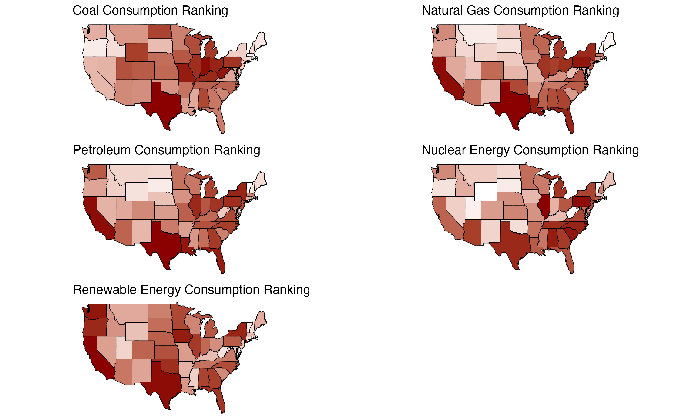

# The Impact of Demographics on Energy Consumption and Renewable Energy Adoption in the United States

This repository contains the code and materials for my research project, where I analyze the relationship between demographic factors and energy consumption patterns—focusing on renewable energy adoption across the United States.

## Overview

In my project, I explore how demographic variables such as income, age, education, and more influence energy consumption and renewable energy adoption across U.S. states. I use state-level data to identify patterns in energy use and offer insights that can inform energy policy.

## Methodology

- **Data Sources:**  
  - I collected energy consumption data from the U.S. Energy Information Administration (EIA).  
  - I obtained demographic data from the U.S. Census Bureau.

- **Techniques:**  
  - I used web scraping to gather the necessary energy consumption data.  
  - I performed regression analysis to examine the relationships between demographic characteristics and energy consumption.

## Results

In my analysis, I examine how demographic factors impact energy consumption in various states. Below is an image that shows the state-level rankings of energy source consumption, highlighting regional differences in energy usage:



For example, Texas appears to lead in energy consumption, which is likely linked to its high GDP.

## Repository Structure

```
├── [Analysis](./Analysis/)        # Contains my main R script (main.R) that runs the analysis
├── [Docs](./Docs/)                # Contains my research paper (PDF) and related documents
├── [Figures](./Figures/)          # Contains generated figures (e.g., energy_type_ranks.png)
├── [Data](./Data/)                # Contains raw data files, including census_data.csv
└── README.md                      # This project overview
```

## Dependencies

- **R** (for running the analysis)

## Reproduction

To reproduce my analysis:

1. Clone the repository:

   ```bash
   git clone https://github.com/acser00/US-Energy-Demographics.git
   cd US-Energy-Demographics
   ```

2. Run the analysis in an R session:

   ```r
   source("Analysis/main.R")
   ```

## More Information

For the full research paper and detailed methodology, please refer to the document in the [Docs](./Docs/) folder. Additional figures and raw data are available in the [Figures](./Figures/) and [Data](./Data/) folders.
